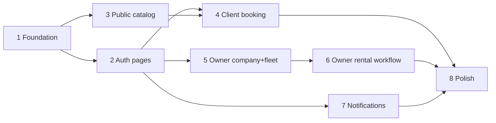

# Car Rental Frontend — Functional Plan

A functional/page-level plan for front-end devs — no code. Verified against the Rent-API backend contract (`API.md` / `BACKEND.md` in the backend repo — keep them at hand; they are authoritative and not vendored here) and this template's source.

## 1. Context

`rent-ui` is the Angular 20 (PrimeNG + Tailwind v4) frontend of the **Rent-API** Spring Boot car-rental marketplace, product name **Keyway**. Base URL `http://localhost:8080/api/v1` (configured in `environment.development.ts`).

It grew out of the sakai template, which contributed the app shell (`AppLayout` — topbar/sidebar/breadcrumbs/footer), the interceptor and toast/confirm plumbing, and light/dark/system theming. Phase 1 replaced the template's auth core with the real contract and re-skinned the whole app in the Keyway design system (§3); what remains of the template is structure, not appearance.

Two personas, chosen at signup and fixed thereafter:

- **CLIENT** — browses the public catalog, requests rentals, views/cancels own rentals.
- **OWNER** — creates exactly one company, manages a fleet (cars, images, price tiers, publish state), processes rental requests through a status workflow.
- **ADMIN** exists in the `UserResponse.role` enum but has no endpoints — no admin UI. If `/auth/me` ever returns ADMIN, treat as an unsupported role (neutral "no workspace" state; do not crash).

Confirmed product decision: **the catalog is public** — anonymous visitors browse/search and view car detail; login is required only to book.

## 2. Backend contract essentials (verified against API.md)

- **Auth endpoints**: `POST /auth/signup` (always 202, enumeration-safe), `POST /auth/verify-email`, `POST /auth/resend-verification` (202), `POST /auth/login`, `POST /auth/refresh`, `POST /auth/logout` (204, revokes all refresh tokens), `GET /auth/me`, `POST /auth/password-reset/request` (always 202), `POST /auth/password-reset/confirm` (revokes all refresh tokens). Login/refresh return `{ accessToken, refreshToken, tokenType, expiresInSeconds }`.
- **Tokens**: access token ~15 min; refresh token 30 days, **rotating** — the presented refresh token is revoked on use, so the new pair must always be stored, and concurrent refreshes must be serialized (a second refresh with the old token gets `401 INVALID_REFRESH_TOKEN`).
- **Identity**: derive user id, name, email, role, and `enabled` from `GET /auth/me`. JWT claim names are not part of the documented contract — do not build logic on decoded claims beyond optional expiry checks.
- **Paging envelope** on every collection: `{ data, page, size, totalPages, totalElements }`; `page` is 0-based, `size` defaults 20, capped at 100.
- **Error envelope** everywhere: `{ code, message, timestamp, path, fieldErrors? }`. **Branch on `code`, never on `message`.** `fieldErrors` (`{ field, message }[]`) only on `VALIDATION_FAILED`.
- **404 vs 403**: a resource that exists but isn't yours is a **404** — never present a 404 as "deleted".
- **Rate limit**: `/auth/*` only, 10 req/min per caller → `429 TOO_MANY_REQUESTS` with `Retry-After` (seconds).
- **Timestamps**: ISO-8601 UTC instants both ways. Rentals need date **and time**; display in the browser's local timezone, convert to UTC on submit.
- **Money**: JSON number with two decimals. Display with fixed two decimals; never recompute totals client-side (server sends `totalPrice`). Currency symbol is not in the contract (assume EUR "€" until confirmed).
- **Pricing**: computed and snapshotted server-side (`dailyPrice`, `totalDays`, `totalPrice`); the client never sends a price. Day count: started 24-hour block from pickup with an exclusive 1-hour grace (24 h = 1 day; 25 h = 2 days). Catalog shows `dailyPriceFrom`.
- **Rental states**: `PENDING → APPROVED → ACTIVE → COMPLETED`; `REJECTED` (owner, from PENDING); `CANCELLED` (client, from PENDING/APPROVED, only before pickup); `EXPIRED` (job, PENDING requests whose start arrives undecided). `PENDING/APPROVED/ACTIVE` block the car.
- **Owner gating**: `/cars*` and `/company/rentals*` return `409 COMPANY_REQUIRED` until `POST /companies` succeeds; `GET /companies/me` itself 409s when no company exists. One company per owner (`409 COMPANY_ALREADY_EXISTS`).
- **Car model** (owner side): make, model, modelYear, licensePlate (unique per company, `409 DUPLICATE_LICENSE_PLATE`, compared ignoring case/spaces/hyphens), defaultDailyPrice, status (`ACTIVE / IN_MAINTENANCE / RETIRED`), `published` flag, price tiers, images. **No fuel/transmission/seats/category** — no filters or fields for them anywhere.
- **Public visibility**: only `published = true AND status = ACTIVE` cars appear publicly. Public DTOs never contain licence plate, car status, or company contact details. A hidden car is a public 404.
- **Public search** `POST /public/cars/filter`: body `{ cityId?, make?, model?, minDailyPrice?, maxDailyPrice?, availableFrom?, availableTo?, sort? }` with `sort` enum `PRICE_ASC | PRICE_DESC | NEWEST | OLDEST` **in the body**; `page`/`size` as query params. Availability dates must be sent **both or neither**.
- **Images**: `POST /cars/{carId}/images`, multipart part `file`, one file per request, JPEG/PNG/WebP, ≤ 10 MB. Errors: `400 UNSUPPORTED_IMAGE_TYPE` / `EMPTY_UPLOAD`, `413 PAYLOAD_TOO_LARGE`, `502 STORAGE_UNAVAILABLE` (nothing saved — retry). `DELETE /cars/{carId}/images/{imageId}`. Lowest `position` = primary; **no reorder endpoint**.
- **Price tiers**: `PUT /cars/{carId}/price-tiers` replaces the whole set. `minDays` required, `maxDays` **optional (open-ended tier)**, `dailyPrice` required; no overlapping brackets (`409 OVERLAPPING_PRICE_TIERS`). Days not covered by any tier fall back to `defaultDailyPrice`.
- **Notifications**: `GET /notifications` (paged, `unreadOnly` param), `GET /notifications/unread-count`, `POST /notifications/{id}/read`, `POST /notifications/read-all`. Types: `RENTAL_REQUESTED, RENTAL_APPROVED, RENTAL_REJECTED, RENTAL_CANCELLED, RENTAL_EXPIRED, RENTAL_PICKUP_REMINDER, RENTAL_RETURN_REMINDER`; each carries a `rentalId`. Activation and completion produce no notification. **No websocket/SSE — poll.**
- **Different rental views per persona**, neither a superset: client's `RentalResponse` includes company contact details; owner's `CompanyRentalResponse` includes the client's name/email and the car's licence plate.
- **CORS**: `localhost:4200` must be added to the backend's `CORS_ALLOWED_ORIGINS` for local dev (document in README).

### Known documentation ambiguities — confirm with backend before/during Phase 5

1. `CompanyResponse.city` / `PublicCompanyResponse.city`: schema says a `CityResponse` object; JSON examples show a plain string. Model defensively; verify against a live response.
2. `CompanyResponse` carries no `cityId`, but `PUT /companies/me` requires one → the edit form must resolve the current city against `GET /cities`.
3. Maximum number of price tiers per car: not documented. Enforce only non-overlap client-side; let the server reject the rest.
4. Full password policy: contract shows only "at least 10 characters". Mirror min-10 client-side; render server `fieldErrors` as the source of truth.
5. Currency symbol/locale for money display.
6. Maximum images per car: not documented.

## 3. Design system — Keyway

The whole product, public and authenticated, is built in one visual language, taken from the **Keyway Web Landing** design (Claude Design project `7147e20e-92bb-4f6b-ae5c-75a8ba7ca491`). Nothing in the phases below is designed page-by-page: every screen composes the pieces in this section. **Do not introduce new colours, radii, shadows or fonts** — if a screen seems to need one, extend this section first.

### 3.1 Where the system lives

| Concern | File | Notes |
|---|---|---|
| PrimeNG palette, radii, form fields | `src/app/core/theme/keyway-preset.ts` | A `definePreset` over Aura. Every PrimeNG component and the sakai layout read `--p-*` from here — this is why buttons, inputs, dialogs, toasts and the sidebar are all on-brand without per-page work. |
| Brand layer over the app shell | `src/assets/layout/_keyway.scss` | Topbar, sidebar, menu, card, footer, typography, plus the `.keyway-*` component classes. Loaded last in `layout.scss`. |
| Tailwind brand utilities | `src/assets/tailwind.css` (`@theme`) | `bg-keyway-green`, `text-keyway-subtle`, `font-display`… Used by the public site, which is built in Tailwind rather than PrimeNG components. |
| Fonts | `src/index.html` | **Sora** (display: headings, logo, CTAs) and **Instrument Sans** (body). |

The runtime theme configurator (preset / primary colour / surface pickers) has been **removed** — the brand is fixed. Only light / dark / system remains, in Settings.

### 3.2 Palette

| Token | Value | Use |
|---|---|---|
| Brand green | `#0f4c3a` | Topbar, hero and CTA bands, primary text accents. PrimeNG `primary.700`. |
| Green (dark mode accent) | `primary.300` | On dark surfaces the deep green goes muddy; the lighter step carries the accent. |
| Lime | `#d7f26a` (hover `#e4fb84`) | **The** call-to-action colour, always with green text on it. One primary action per screen. |
| Cream | `#f7f6f3` | Page ground, light mode (`surface.50`). |
| Ink / body / muted | `#17201c` / `#3a453f` / `#66716b` | Text ramp. |
| Warm neutrals | `surface.0–950` | Cards, borders, dark-mode surfaces. Never grey-blue — the neutrals are warm. |

### 3.3 Component vocabulary

- **Card** — `.card`: white (`surface.900` in dark), 16 px radius, `--keyway-shadow-md`, no border in light; border and no shadow in dark. The unit every panel is built from.
- **Lime CTA** — `.keyway-cta`: Sora, bold, 12 px radius. The single primary action on a screen. Everything else is a normal PrimeNG button (`severity="secondary"` / text).
- **Green band** — `.keyway-band` + `.keyway-band-blob`: the hero treatment. Used for the landing hero, the dashboard welcome, the CTA band. Decorative blobs are `rgba(255,255,255,0.05)` circles.
- **Logo mark** — `.keyway-logo-mark`: 34 px lime rounded square holding the car glyph. Identical in the public nav, the app topbar, the auth cards and the status pages.
- **Section title** — `.keyway-section-title`: Sora 700, `-0.5px` tracking. Above card groups.
- **Field chrome** — `.keyway-field`: the bordered box with a leading icon that wraps a stripped-back PrimeNG control (see the landing search bar). Use it wherever an input needs the landing-page treatment; plain PrimeNG fields are fine everywhere else.
- **Status page** — `<app-status-page>`: the shared shell for 404 / access-denied / error, and the same card treatment the auth screens use.
- **Empty state** — `<app-empty-state>`: icon chip, Sora title, muted line, optional lime CTA.
- **Card grid** — 4 columns at `xl`, 2 at `sm`, 1 below; 20 px gap; cards lift 3 px on hover with the `--keyway-shadow-lg`.

### 3.4 Rules for new screens

1. Page ground is the cream/`surface.50` ground; content sits on `.card`s. Never a card on a card.
2. Headings are Sora via `<h1>`–`<h4>` or `.keyway-section-title`; body copy is Instrument Sans at 14–15 px with `1.5`+ line height.
3. One lime CTA per screen. Destructive actions are PrimeNG `severity="danger"`, never lime.
4. Every screen must work in dark mode — check it before calling a page done. Brand green and lime hold in both; surfaces swap.
5. Every screen must work down to 360 px. Tables become stacked cards on mobile (see §6, Phase 8).
6. Loading is skeletons shaped like the content (grey blocks at the real dimensions), never a spinner — see the landing "Popular near you" band.
7. Decorative SVG gets `aria-hidden="true"`; icon-only buttons get an `aria-label`.

## 4. Global UX conventions (apply to every page)

- **Loading**: global top progress bar (existing `LoadingService`) stays; list/detail pages additionally show skeletons on first load, not spinners.
- **Empty states**: existing `EmptyState` component with a contextual action (e.g. "No cars match — clear filters").
- **Errors**: a single error-code → user-copy map; unknown codes fall back to the server `message`. `VALIDATION_FAILED` never toasts — its `fieldErrors` bind to form controls (unmatched errors in a form-level summary). Business 409s (`CAR_NOT_AVAILABLE`, `INVALID_RENTAL_TRANSITION`, etc.) are handled inline by the owning page; the interceptor toasts only errors nobody handled.
- **Dates**: display in local time with explicit format incl. time; submit as UTC ISO instants.
- **Money**: always two decimals; totals always the server's numbers.
- **Status badges**: one shared rental-status badge and one car-status badge, reused everywhere, drawn from the brand palette (§3.2) rather than generic traffic-light colours — PENDING amber `#e8a13a` on mint, APPROVED brand green outline, ACTIVE brand green solid, COMPLETED neutral surface, REJECTED/CANCELLED muted red, EXPIRED muted grey. APPROVED and ACTIVE differ by fill, not hue, so the pair reads as one progression.
- **Pagination**: shared pager bound to the backend envelope; page state in URL query params on list pages.
- **404 handling**: missing/hidden resource routes to the not-found page (or an in-page "no longer available" state on public car detail), never a raw toast alone.

## 5. Page inventory and acceptance criteria

### 5.1 Public area (no auth)

Shell: `AppPublicLayout` — green nav (logo mark, Fleet / How it works / Reviews, theme toggle, Sign in + Sign up, or the user's name + Dashboard + Log out when authenticated) over a cream ground, with the multi-column brand footer. Built in Phase 1.

**Landing — `/`** *(built in Phase 1)*: hero, search card (city + pick-up/return date-time → serialises to `/cars` query params), "Popular near you" (live `POST /public/cars/filter`, `size=4`, skeletons, hides itself when empty or unreachable), "How it works", testimonials (**placeholder copy — see §7**), CTA band. This page is the reference implementation of §3.

**Catalog — `/` (also `/cars`)**
- Filter bar: city dropdown (from `GET /cities`, label "Name (COUNTRY)"), make and model text inputs, min/max daily price, availability window (date-time range picker), sort dropdown (Price ↑, Price ↓, Newest, Oldest).
- Availability inputs validate both-or-neither and from < to; helper text "showing only cars free for this window" when set.
- Results: responsive card grid — primary image (placeholder when null), make model year, "from {dailyPriceFrom}/day", company name + city. Card click → detail.
- Search on explicit "Search" and on sort/page change; filters and page serialize to URL query params (shareable/back-safe); page resets to 0 on filter change.
- Shared pager; skeleton cards while loading; empty state with "clear filters".
- *Acceptance*: an anonymous user can find a car by city + dates and reach its detail; reload preserves filters; invalid price range and half-open date range blocked client-side.

**Car detail — `/cars/:id`**
- From `GET /public/cars/{carId}`. Gallery from `imageUrls` (first = primary; placeholder when empty), make/model/year, company block (name, description, city, address — no contact details, per contract), pricing panel: `defaultDailyPrice`, "from `dailyPriceFrom`", tier table ("3–6 days → 30.00/day", open-ended "7+ days" when `maxDays` absent, plus a row for other durations at the default price).
- Booking entry: date-time range preselected from catalog filters (carried via query params) + "Request booking" CTA.
  - Anonymous → redirect to `/auth/login?returnUrl=<this page incl. dates>`.
  - Logged-in CLIENT → booking flow (5.3).
  - Logged-in OWNER → CTA replaced by a note ("Bookings are for client accounts") — `POST /rentals` is CLIENT-only.
- 404 (unpublished/retired/unknown) → in-page "This car is no longer available" state with catalog link.
- *Acceptance*: every price row renders with two decimals; a car unpublished between catalog and detail shows the friendly unavailable state, not an error toast.

### 5.2 Auth area (`/auth/*`, standalone full-page card shell — same treatment as the status pages)

**Login — `/auth/login`**
- Email + password. Success: store token pair, load `/auth/me`, redirect to `returnUrl` else `/dashboard` (owner-company gate may bounce to `/company/setup`).
- Branches by `code`: `INVALID_CREDENTIALS` → inline form error (no toast/logout side effects); `ACCOUNT_NOT_VERIFIED` → `/auth/verify-email` with email prefilled; `ACCOUNT_DISABLED` → inline message; `429` → inline countdown from `Retry-After`, submit disabled.
- Links: register, forgot password, "browse cars without an account".

**Register — `/auth/register`**
- First/last name (≤100), email, password + confirm, prominent **role choice** ("I want to rent cars" = CLIENT / "I run a rental company" = OWNER) as two selectable cards, CLIENT preselected.
- Client-side password validation: min 10 chars + live requirement hints (server authoritative via `fieldErrors`).
- Signup always returns 202 with an identical body — the UI cannot detect an existing email; always navigate to `/auth/verify-email` with email prefilled and copy "If this address is new, a verification code has been emailed to it."
- `VALIDATION_FAILED` → field binding. 429 as on login.

**Verify email — `/auth/verify-email`**
- Email (prefilled, editable) + 6-digit code input (auto-advance boxes). Success → route to login (verification does not log in).
- Resend with local cooldown (~60 s); note that resending invalidates the previous code.
- 409 branches: `INVALID_VERIFICATION_CODE` (inline), `VERIFICATION_CODE_EXPIRED` and `TOO_MANY_VERIFICATION_ATTEMPTS` (inline + emphasize resend). 429 countdown.

**Forgot password — `/auth/forgot-password`** — email only; always 202 → confirmation with link to reset page.

**Reset password — `/auth/reset-password`** — email (prefilled if from forgot), 6-digit code, new password + confirm. Success → "Password changed — please log in" → login (confirm revokes all refresh tokens). 409 branches as verify-email.

**Keep**: access-denied (`/auth/access`), error, not-found pages.

### 5.3 Client area (authGuard + role CLIENT, inside AppLayout)

**Booking flow — from car detail (dialog or `/cars/:id/book` step page)**
- Pickup and return date-time (local → UTC). Client-side: return after pickup, pickup in the future.
- Non-binding estimate panel: day count via the documented billing rule + matching tier price, labelled "Estimate — final price is set when the request is created."
- `POST /rentals` → on 201 show confirmation with the **server's** snapshot (PENDING, dailyPrice, totalDays, totalPrice, company name/city) and links to rentals. Explain PENDING and that an undecided request expires at pickup time.
- Branches: `400 INVALID_RENTAL_PERIOD` (inline on dates), `409 CAR_NOT_AVAILABLE` (inline "try different dates", keep form), `404` (car vanished → unavailable state).

**My rentals — `/rentals`**
- `GET /rentals` paged, newest first; status filter tabs ("All" + the 7 statuses, one at a time — what the API accepts). Rows: car, company + city, start–end (local), total price, status badge. Click → detail. Empty state → "Browse cars".

**Rental detail — `/rentals/:id`**
- Full `RentalResponse`: status with plain-language explanation, dates, dailyPrice × totalDays = totalPrice breakdown, car summary, company block **with contact email/phone and address** (where the client learns pickup contact).
- Cancel only when PENDING/APPROVED **and** pickup in the future (hide otherwise); confirm dialog; on `409` (`RENTAL_ALREADY_STARTED` or transition conflict) explain and refetch. 404 → not-found.

**Client dashboard — `/dashboard`** — next upcoming rental, active rental card, counts by status, "Browse cars" CTA (from one `GET /rentals` first page).

### 5.4 Owner area (authGuard + role OWNER, inside AppLayout)

**Company gate (guard behaviour)**
- On first entry to any owner route, resolve `GET /companies/me` once and cache: 200 → proceed; `409 COMPANY_REQUIRED` → redirect to `/company/setup`. `/company/setup` reachable only by owners **without** a company (others → `/company`).

**Company setup — `/company/setup`**
- Onboarding framing ("Create your company to start listing cars"). Form: name (≤150), description (≤2000, optional), city (from `GET /cities`), address (≤255), contact email, contact phone. Success → `/fleet` with "add your first car" prompt. `409 COMPANY_ALREADY_EXISTS` → refresh gate cache → `/company`.

**Company profile — `/company`**
- View + edit (`GET/PUT /companies/me`); current city preselected (see §2 ambiguities 1–2). Note that the public catalog shows name/city/address/description only; contact details appear to clients on their rental views.

**Fleet list — `/fleet`**
- `GET /cars` paged table: make/model/year, plate, default price, car-status badge, published badge; actions: edit, publish/unpublish (optimistic row update), delete.
- Delete confirm copy covers both outcomes — "a never-rented car is deleted with its photos; a car with rental history is retired and unpublished instead". Refetch after.
- Visibility hint: a published car that is `IN_MAINTENANCE`/`RETIRED` shows "not publicly visible" (public requires published **and** ACTIVE).
- Empty state → "Add your first car".

**Car create — `/fleet/new`; car edit — `/fleet/:id`**
- Create: make (≤80), model (≤80), model year (sensible bounds), plate (≤20, hint that uniqueness ignores case/spaces/hyphens), default daily price (> 0, two decimals), status select. `409 DUPLICATE_LICENSE_PLATE` → inline on plate field. On 201 → edit page.
- Edit adds three sections:
  - **Images**: thumbnail grid by `position`; lowest labelled "Primary — shown in the catalog"; upload (one file per request; client-side pre-check JPEG/PNG/WebP ≤ 10 MB; per-file progress; multiple files sequential). Delete with confirm. Branches: `UNSUPPORTED_IMAGE_TYPE`, `EMPTY_UPLOAD`, `413`, `502` ("nothing saved — try again"). State plainly: no reordering; to change the primary photo, delete and re-upload in order.
  - **Price tiers**: editable rows (min days, max days *optional* — empty = "and up", daily price); open-ended allowed on at most the last row; validation: minDays ≥ 1, maxDays ≥ minDays, no overlaps, sorted display; preview lines ("3–6 days → 30.00/day", "7+ days → 25.00/day", "all other durations → default 40.00/day"). Save replaces the set; `409 OVERLAPPING_PRICE_TIERS` → form-level error. Removing all rows clears tiers.
  - **Publish panel**: current state, publish/unpublish button, visibility rule copy.

**Rental requests — `/company/rentals`**
- `GET /company/rentals` paged, newest first, status tabs (land on PENDING — the actionable queue). Rows: car (make/model + plate), client name, start–end, total price, badge, quick actions per state.
- Actions by status: PENDING → Approve / Reject; APPROVED → Activate ("car handed over"); ACTIVE → Complete ("car returned"); terminal → none. Each: confirm dialog → `POST /company/rentals/{id}/{action}` → update from response. `409 INVALID_RENTAL_TRANSITION` → informational toast + refetch.
- Approve confirm notes the car becomes held for those dates; Reject confirm notes the client is notified.

**Rental request detail — `/company/rentals/:id`**
- Full `CompanyRentalResponse`: client name + email, car incl. plate, dates, price breakdown, created time, status timeline (requested → approved → picked up → returned, with dead-ends for rejected/cancelled/expired), same guarded actions.

**Owner dashboard — `/dashboard`** — pending-request count (deep-link to PENDING-filtered list), active rentals, fleet size + published count (from `GET /cars` `totalElements` — approximate, no stats endpoint), "Add car" CTA, company card.

### 5.5 Shared authenticated pieces

- **Dashboard `/dashboard`** — one route, role-switched content.
- **Notification bell** (topbar): badge from `unread-count` polled every 60 s (pause when tab hidden; refresh on focus and after login); popover loads first page of `GET /notifications` on open — type icon, message, relative time, unread dot; click marks read + deep-links via `rentalId` to `/rentals/:id` (CLIENT) or `/company/rentals/:id` (OWNER); "mark all read"; link to full page.
- **Notifications page `/notifications`** — paged list with "unread only" toggle, same row behaviour.
- **Menu / topbar**: sidebar by role (`app.menu.ts` currently has a static model — make it role-switched) — CLIENT: Dashboard, Browse cars, My rentals, Notifications, Settings; OWNER: Dashboard, Company, Fleet, Rental requests, Notifications, Settings. Topbar user menu: name + role label, Settings, Logout. Logout calls `POST /auth/logout` (best-effort — clear local session even if it fails), clears tokens + user signal, stops polling, routes to `/`.
- **Settings `/settings`**: light/dark/system switcher plus a read-only account card. The template's runtime theme configurator (preset / primary colour / surface pickers) is **removed** — the brand is fixed by §3. Do **not** add change-password (no logged-in endpoint; logout + forgot-password is the path).
- **Removed template pages**: profile edit (no `PUT /users/{id}` in the contract), mock notification wiring, template-only auth calls.

## 6. Implementation phases

Dependencies: Phase 1 blocks everything; 2 blocks 4–7; 3 blocks 4; 5 blocks 6. Phase 3 can run in parallel with 2 (public pages need no auth).

**Every phase carries its own design work — there is no "design pass" phase.** A page is not done until it composes §3's vocabulary, works in dark mode, and holds together at 360 px. Phase 8 audits; it does not retrofit.

The source design lives in the Claude Design project `7147e20e-92bb-4f6b-ae5c-75a8ba7ca491` (`Keyway Web Landing.dc.html`), readable through the design MCP. It is a marketing landing page; the app screens extend its vocabulary rather than copying its layout.

### Phase 1 — Foundation: API alignment and auth core
1. **Models**: TS interfaces/enums for every schema in API.md (token pair, user, city, public car summary/detail + filter, company, car + image + price tier, rental client view, company rental owner view, notification, unread count, generic page envelope, ApiError + FieldError, all enums). Replace the template's `core/models/auth.model.ts` / `user.model.ts` / `notification.model.ts`.
2. **Token handling**: store access + refresh tokens (replacing `JwtService`'s single localStorage `token` key); session restore on startup = `GET /auth/me` populates the current-user signal (role/name/id from here, not JWT claims); expose `role` and `isLoggedIn` signals.
3. **AuthService rework** to real endpoints: login, signup, verify-email, resend-verification, refresh, logout, password-reset request/confirm, me. Delete the `/users`-based register/load/update calls and the `loginNoBackend()` mock helper.
4. **Auth interceptor**: bearer on all requests except public auth endpoints; on `401` from a non-auth endpoint, **one** single-flight `POST /auth/refresh` (concurrent 401s wait on the same refresh), store new pair, replay original; if refresh fails, clear session, remember `returnUrl`, route to login with "session expired" — only if the user was logged in (anonymous browsing never redirected).
5. **Error interceptor rework**: parse `ApiError`; branch on `code`; do **not** toast codes owned by forms/pages (`VALIDATION_FAILED`, `INVALID_CREDENTIALS`, `ACCOUNT_NOT_VERIFIED`, verification 409s, business 409s); toast 500/network/unhandled; surface `429` with `Retry-After`. Remove the current "destroy token + redirect + toast on any 401" and the blanket 403/404 toasts (404 handling per §4; 401 now owned by the refresh flow).
6. **Guards**: `authGuard` gains `returnUrl` capture; `roleGuard` keeps its factory shape but reads the current-user signal (await session restore) instead of JWT claims; new **owner-company guard** per §5.4 with cached company state.
7. **Route skeleton**: public layout at `/` (catalog placeholder); `AppLayout` moves under guarded routes (`/dashboard`, `/rentals`, `/fleet`, `/company`, `/settings`, `/notifications`); remove `/profile`; role-aware menu; breadcrumbs/titles for new routes.
8. **Housekeeping**: rename `package.json` name (`sakai-ng` → `rent-ui`) and environment `appName`s; README note about backend `CORS_ALLOWED_ORIGINS` needing `http://localhost:4200`; start the error-code → copy map.
9. **Design system** (§3): Keyway PrimeNG preset, `_keyway.scss` brand layer, Sora/Instrument Sans, `.keyway-*` component classes; retire the runtime theme configurator; restyle the shell, auth screens, status pages, dashboard, settings and the shared `EmptyState`. The public landing page at `/` is built here as the reference implementation of the system.

*Acceptance*: app boots logged-out onto a public shell; a stored valid token pair restores a session via `/auth/me`; an expired access token refreshes transparently exactly once per burst; a revoked refresh token lands on login with return URL preserved.

### Phase 2 — Auth pages and onboarding flows
All of §5.2: login (code branches, returnUrl, role routing), register (role cards, password hints, always-202 → verify), verify-email (6-digit UX, resend cooldown, 409 branches), forgot/reset password, 429 countdowns on all auth forms, logout wiring. New routes registered in `features/auth/auth.routes.ts`.
*Design*: every auth screen is the shared card shell already used by login/register/status pages — logo mark, Sora heading, muted subline, lime CTA, one card, no page chrome. The role choice on register becomes two selectable cards (green ring + mint fill when active) rather than a select-button. The 6-digit code input is six `.keyway-field`-style boxes. 429 countdowns render as an inline `p-message`, never a toast.
*Acceptance*: both persona journeys signup → verify → login work end-to-end; unverified login lands on verify with email prefilled; wrong/expired/exhausted codes each show distinct guidance; every screen checked in dark mode and at 360 px.

### Phase 3 — Public catalog
Public layout (anonymous vs logged-in header), catalog with full filter bar, URL-serialized state, pagination, skeletons, empty state; car detail with gallery, tier table, company block, unavailable-404 state, role-aware Book CTA.
*Design*: the catalog reuses the landing page's search card (`.keyway-field` chrome) as a sticky filter bar, and its car card and skeleton verbatim — the landing "Popular near you" band is the prototype for the grid. Car detail: full-bleed gallery, `.card` for the tier table, green `.keyway-band` for the booking panel, lime CTA for "Request booking".
*Acceptance*: §5.1 criteria; both-or-neither dates enforced; a deep-linked filtered URL reproduces the search; grid reflows 4 → 2 → 1 and the filter bar stacks on mobile.

### Phase 4 — Client booking and rentals
Booking flow (estimate + disclaimer, UTC conversion, `INVALID_RENTAL_PERIOD`/`CAR_NOT_AVAILABLE` branches, PENDING explainer), my-rentals list with status tabs, rental detail with breakdown + company contact + guarded cancel, client dashboard widgets.
*Design*: rental rows are cards, not table rows, so they need no mobile variant; status tabs are a PrimeNG `p-tabs` in brand colours; the price breakdown sits in a bordered sub-panel inside the detail `.card`; the confirmation screen uses the green band with the server's snapshot. Status badges follow §4 and are built once here as a shared component.
*Acceptance*: a client books a car found via availability search and sees the server-priced confirmation; cancelling an APPROVED future rental works; post-pickup cancel impossible in UI and raced case handled (`RENTAL_ALREADY_STARTED`); dark mode and 360 px checked.

### Phase 5 — Owner: company and fleet
Owner-company guard live; company setup + profile (resolve the `city` shape ambiguity here against a live response); fleet list with publish toggles and dual-outcome delete; car create/edit; image manager; price-tier editor (open-ended tiers, overlap validation, wholesale replace); publish panel.
*Design*: company setup is the onboarding card shell (green band header, one `.card`, lime CTA). The fleet list is a PrimeNG table on desktop that becomes stacked cards below `md` — build both now, not in Phase 8. Car edit is three stacked `.card`s (details / images / pricing) plus a publish panel; the image grid reuses the catalog card's image treatment with a "Primary" chip on the lowest position; price-tier rows are compact inline fields with a live preview list.
*Acceptance*: a fresh owner is forced through setup exactly once; a created, photographed, tiered, published ACTIVE car appears in the anonymous catalog with the right "from" price; duplicate plate shows on the plate field; unpublishing removes it from the catalog (detail URL → unavailable state); fleet table and car edit checked in dark mode and at 360 px.

### Phase 6 — Owner: rental request workflow
Company rentals list (PENDING-first queue), detail with status timeline, four guarded actions with confirms and response-driven updates, `INVALID_RENTAL_TRANSITION` → refetch, owner dashboard widgets.
*Design*: the request queue reuses the Phase 4 rental card with an actions row; the status timeline is a horizontal stepper in brand green with muted dead-ends for rejected/cancelled/expired. Approve is the lime CTA; reject is `severity="danger"` text — never two lime buttons side by side.
*Acceptance*: full happy path PENDING → APPROVED → ACTIVE → COMPLETED drivable from the UI; car returns to availability after completion; approving a just-cancelled request shows the conflict and refreshed state; dark mode and 360 px checked.

### Phase 7 — Notifications
Replace template bell wiring: new model (7 event types, `rentalId`), paged GET, **POST** verbs (template currently uses PUT), separate `unread-count` endpoint with polling (60 s, visibility-aware, focus refresh, starts on login/stops on logout), popover + role-aware deep links, mark-read/read-all, full page with `unreadOnly` toggle.
*Design*: the bell popover and the full page share one notification row — type icon chip, message, relative time, unread dot in brand green. The badge is the one place red is allowed. The full page is a single `.card` list with the unread-only toggle in its header.
*Acceptance*: an owner sees the badge rise within a minute of a client's request without reloading; clicking opens the owner rental detail and clears the dot; client notified on approve/reject/expiry; reminders deep-link correctly; dark mode and 360 px checked.

### Phase 8 — Polish and hardening
Complete the error-code copy map (every code in API.md); empty/skeleton audit; breadcrumbs + titles for all routes; session-expiry UX review; money/date formatting audit; accessibility pass on forms/dialogs (labels, focus order, dialog focus traps, contrast — lime on green and muted-on-cream both need checking); refresh CLAUDE.md and README (both still describe the template); manual end-to-end smoke of both persona journeys including raced-conflict paths (double-book, transition conflict, expired code).

**Design audit** — a review, not a retrofit, since every phase shipped its own design: one pass over all screens in light and dark at 360/768/1280 px; confirm no page introduced a colour, radius, shadow or font outside §3; confirm one lime CTA per screen; replace the placeholder testimonials on the landing page with real ones or delete the section (see §7).

## 7. Explicitly out of scope (no backend support — build nothing, remove template stubs)

Profile editing; change password while logged in; admin screens; payments/invoicing; reviews/ratings; favourites; chat; OAuth logins; image reordering; car attributes beyond the minimal model; multi-company or employee roles; real-time push (polling only); runtime theme/palette switching beyond light/dark/system.

**Outstanding content debt.** The landing page's "Trusted by drivers" band (three testimonials and a "4.8 ★ · 12k reviews" badge) is placeholder copy carried over from the design — there is no reviews feature, so none of it is real. It is isolated as `PLACEHOLDER_REVIEWS` in `features/home/home.ts`. Before the site is public it must be replaced with genuine, attributable testimonials or deleted; the same goes for any product claim in the marketing copy that the contract does not support.
